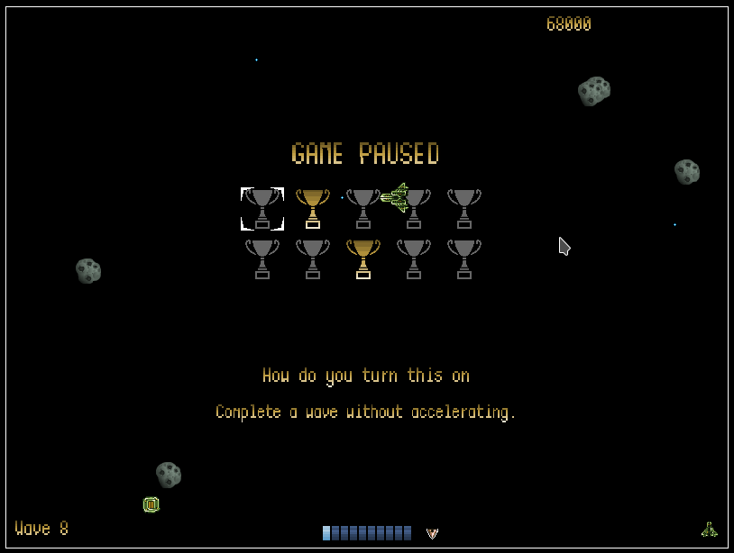

# AsteroidsGame

Inspired by classic asteroids-style game, made in [Phaser](http://phaser.io/).

[Play it now.](https://iamsilver.net/AsteroidsGame/)

### What is currently done

- Three different shoot/bullet types ("weapons")
- Big asteroids fall apart
- Asteroid "waves"
- Pickups (score/life/charge)

### TODOs

- There's still one TODO left in game.js regarding optimization
- Notification on the UI regarding achievements achieved
- Rework pausing game so sounds will work on pause screen
- Add UFOs or similiar enemies

### How it looks

Game in action (excuse poor GIF quality):
 

Achievements!
 
